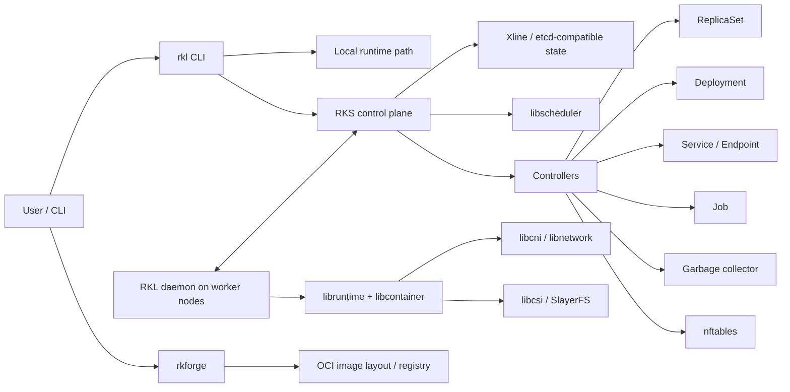

# rk8s

rk8s is a Rust monorepo for building a lightweight Kubernetes-style container
orchestration stack. The current codebase centers on:

- **RKL**: a node-side container runtime and CLI built on Youki/libcontainer.
- **RKS**: a QUIC-based control plane with scheduling, controllers, DNS, service
  networking, and Xline-backed state.
- **rkforge**: an OCI image build, pull, push, login, and runtime helper tool.
- **distribution**: a lightweight OCI Distribution API implementation.

The project is maintained by the Web3 Infrastructure Foundation with support
from Associate Professor Feng Yang's lab at Nanjing University and the
Institute of Software Chinese Academy of Sciences through [R2CN](https://r2cn.dev).

This project is still **WIP** and should not be used in production.

## Current Status

The repository has moved beyond the original single-runtime prototype. The
root project is now a Cargo workspace under `project/`, with Buck2/Buckal files
generated for monorepo builds.

RKL's preferred CLI path is now close to `kubectl`:

- `rkl apply -f <file>` applies supported resource YAML. Pod and Container
  files use the create path; Deployment, ReplicaSet, and Service files use
  create-or-update paths.
- `rkl get <resource> [name]` reads resources.
- `rkl delete <resource> <name>` deletes resources.
- `rkl run <container.yaml>` runs a standalone container.
- `rkl exec`, `rkl logs`, and `rkl attach` provide runtime interaction.

Older commands such as `rkl pod`, `rkl container`, `rkl deployment`,
`rkl replicaset`, and `rkl service` still exist for compatibility. Several of
them now print deprecation warnings and delegate to the newer command path.

## Architecture



### Component Responsibilities

| Component | Path | Responsibility |
| --- | --- | --- |
| RKL | `project/rkl` | CLI, standalone container and pod lifecycle, worker daemon, QUIC client, CNI/CSI node handling, log/attach/exec paths |
| RKS | `project/rks` | Control plane server, scheduler integration, controllers, Xline persistence, node registration, DNS, service IP allocation, TLS/join-token flow |
| common | `project/common` | Shared resource types, protocol messages, Pod/Node/Service/Deployment/ReplicaSet/Job models |
| libruntime | `project/libruntime` | Shared runtime logic for image handling, OCI config generation, root paths, volumes, and network config |
| libscheduler | `project/libscheduler` | Scheduling framework and plugins such as node name, node affinity, pod affinity, resources fit, taints/tolerations, and balanced allocation |
| libcni / libnetwork | `project/libcni`, `project/libnetwork` | CNI plugin support, bridge/flannel-style networking, service/nftables support |
| libcsi | `project/libcsi` | CSI traits, types, and QUIC message model |
| rkforge | `project/rkforge` | Dockerfile-style OCI image builds, registry pull/push/login/logout, local container/pod/compose helpers, overlay/rootfs helpers |
| distribution | `project/distribution` | Lightweight OCI registry server |
| libvault | `project/libvault` | Certificate and credential storage used by RKS TLS and registry credential flows |
| slayerfs / libfuse-fs / rfuse3 | `project/slayerfs`, `project/libfuse-fs`, `project/rfuse3` | FUSE and distributed filesystem pieces used by storage paths |
| dagrs / dagrs-derive | `project/dagrs`, `project/dagrs-derive` | DAG execution library kept in the workspace |
| Xline | `project/Xline` | Vendored/reference etcd-compatible storage project used by RKS deployments |

## Supported Resource Surface

RKL currently exposes these resource types through the generic CLI:

| Kind | Generic commands | Notes |
| --- | --- | --- |
| `Container` | `rkl run`, `rkl apply -f`, `rkl get container`, `rkl delete container` | Local standalone runtime path |
| `Pod` | `rkl apply -f`, `rkl get pod`, `rkl delete pod` | Local mode without `--cluster`; cluster mode with `--cluster` or `RKS_ADDRESS` |
| `ReplicaSet` | `rkl apply -f`, `rkl get rs`, `rkl delete rs` | Requires RKS |
| `Deployment` | `rkl apply -f`, `rkl get deploy`, `rkl delete deploy` | Requires RKS; rollback/history use deployment-specific commands |
| `Service` | `rkl apply -f`, `rkl get svc`, `rkl delete svc` | Requires RKS; supports ClusterIP allocation when `ServiceCIDR` is configured |

RKS also contains server-side Job support and a Job controller. The current RKL
top-level CLI does not yet expose generic `job` commands.

## Repository Layout

```text
rk8s/
|-- docs/                    # Development, image, design, and contribution docs
|-- project/                 # Main Cargo workspace
|   |-- Cargo.toml           # Workspace manifest
|   |-- common/              # Shared API and protocol types
|   |-- distribution/        # OCI registry implementation
|   |-- libcni/              # CNI support
|   |-- libcsi/              # CSI interfaces and protocol messages
|   |-- libnetwork/          # Network config, flannel/bridge/service pieces
|   |-- libruntime/          # Runtime, image, OCI, volume helpers
|   |-- libscheduler/        # Scheduler framework and plugins
|   |-- libvault/            # Certificate and credential storage
|   |-- rkl/                 # Runtime CLI and worker daemon
|   |-- rks/                 # Control plane
|   |-- rkforge/             # OCI image build/pull/push tool
|   |-- slayerfs/            # Distributed filesystem
|   `-- test/                # Shared test assets and CNI config
|-- third-party/             # Buckal-managed third-party sources
|-- toolchains/              # Buck toolchain definitions
|-- setup.sh                 # Developer environment setup helper
|-- install.sh               # Binary installer helper
`-- README.md
```

## Prerequisites

Runtime operations target Linux and normally require root privileges because
they create namespaces, cgroups, mounts, CNI networks, and nftables rules.

For development builds, install:

- Rust toolchain
- `clang`, `lld`, `pkg-config`
- `protobuf-compiler`
- `seccomp` and `libseccomp-dev`
- OpenSSL development headers
- `zstd`
- Docker or another OCI-compatible tool when preparing or testing images
- Buck2 and `cargo-buckal` if using Buck builds

On supported Linux distributions, `setup.sh` installs the common development
dependencies:

```bash
./setup.sh
```

## Build

The main workspace lives in `project/`.

```bash
cd project
cargo build
```

`cargo build` builds the workspace default members:

- `distribution`
- `rkl`
- `rkforge`
- `rks`

Build a specific component:

```bash
cd project
cargo build -p rkl
cargo build -p rks
cargo build -p rkforge
cargo build -p distribution
```

Build with Buck2:

```bash
buck2 build //project/...
```

## Install Binaries

The repository includes an installer for published binaries:

```bash
curl -sSf https://download.rk8s.dev/install.sh | sh
```

Install selected components:

```bash
curl -sSf https://download.rk8s.dev/install.sh | sh -s -- -c rks,rkl
curl -sSf https://download.rk8s.dev/install.sh | sh -s -- --all
```

Local development builds produce binaries under `project/target/debug/` or
`project/target/release/`.

## Quick Start: Local RKL

Prepare CNI config:

```bash
sudo mkdir -p /etc/cni/net.d
sudo cp project/test/test.conflist /etc/cni/net.d/
```

Run a standalone container from a YAML spec:

```bash
sudo project/target/debug/rkl run container.yaml
sudo project/target/debug/rkl get container
sudo project/target/debug/rkl exec <container-name> -- /bin/sh
sudo project/target/debug/rkl delete container <container-name>
```

Example container spec:

```yaml
apiVersion: v1
kind: Container
name: busybox-demo
image: busybox:latest
args:
  - sleep
  - "3600"
resources:
  limits:
    cpu: "500m"
    memory: "256Mi"
```

Run a pod locally:

```bash
sudo project/target/debug/rkl apply -f pod.yaml
sudo project/target/debug/rkl get pod
sudo project/target/debug/rkl exec <pod-name> -c <container-name> -- /bin/sh
sudo project/target/debug/rkl delete pod <pod-name>
```

Example pod spec:

```yaml
apiVersion: v1
kind: Pod
metadata:
  name: busybox-pod
  labels:
    app: busybox
spec:
  containers:
    - name: busybox
      image: busybox:latest
      args:
        - sh
        - -c
        - while true; do sleep 3600; done
      ports:
        - containerPort: 80
      resources:
        limits:
          cpu: "500m"
          memory: "512Mi"
```

Image values can be local bundle paths such as `./project/test/bundles/busybox`
or OCI image references such as `busybox:latest`. Path-like values beginning
with `/`, `./`, or `../` are treated as local bundles and must exist.

## Quick Start: RKS Cluster

RKS uses Xline as its etcd-compatible state backend. See
[project/rks/README.md](project/rks/README.md) for the full multi-node flow.

Minimal RKS config shape:

```yaml
addr: "127.0.0.1:50051"
xline_config:
  endpoints:
    - "http://127.0.0.1:2379"
  prefix: "/coreos.com/network"
  subnet_lease_renew_margin: 60
network_config:
  Network: "10.1.0.0/16"
  SubnetMin: "10.1.1.0"
  SubnetMax: "10.1.254.0"
  SubnetLen: 24
  ServiceCIDR: "10.96.0.0/16"
  ServiceSubnetLen: 24
tls_config:
  enable: false
  vault_folder: ""
  keep_dangerous_files: false
dns_config:
  Port: 5300
```

Start RKS:

```bash
sudo project/target/debug/rks start --config config.yaml
```

Start an RKL worker daemon:

```bash
sudo RKS_ADDRESS=127.0.0.1:50051 project/target/debug/rkl pod daemon
```

Use the cluster from RKL:

```bash
sudo project/target/debug/rkl apply -f pod.yaml --cluster 127.0.0.1:50051
sudo project/target/debug/rkl get pod --cluster 127.0.0.1:50051
sudo project/target/debug/rkl logs <pod-name> --cluster 127.0.0.1:50051
sudo project/target/debug/rkl delete pod <pod-name> --cluster 127.0.0.1:50051
```

`--cluster` can be replaced by the `RKS_ADDRESS` environment variable.

## RKL Command Reference

| Command | Purpose |
| --- | --- |
| `rkl apply -f <file>` | Apply `Pod`, `Container`, `Deployment`, `ReplicaSet`, or `Service` YAML; Pod/Container create, the other kinds create or update |
| `rkl run <container.yaml>` | Run a standalone container |
| `rkl get <resource> [name]` | List or get `pod`, `container`, `deploy`, `rs`, or `svc` |
| `rkl delete <resource> <name>` | Delete a supported resource |
| `rkl exec <target> [-c container] -- <cmd>` | Execute a command in a pod or container |
| `rkl logs <pod> [-c container]` | Read pod logs through RKS |
| `rkl attach <pod> [-c container] --cluster <addr>` | Attach to a pod container through RKS |
| `rkl pod daemon` | Run the worker/static-pod daemon |
| `rkl deployment history <name>` | Show Deployment revision history |
| `rkl deployment rollback <name> --to-revision <n>` | Roll back a Deployment |

Resource aliases accepted by `get` and `delete` include:

- Pod: `pod`, `po`, `pods`
- Container: `container`, `c`, `containers`
- Deployment: `deployment`, `deploy`, `deployments`
- ReplicaSet: `replicaset`, `rs`, `replicasets`
- Service: `service`, `svc`, `services`

## RKS Command Reference

| Command | Purpose |
| --- | --- |
| `rks start --config <config.yaml>` | Start the control plane |
| `rks gen certs <config.yaml>` | Generate TLS and vault-backed certificates |
| `rks gen join-token [--port 6789]` | Fetch a join token from the local internal server |
| `rks login [server] --config <config.yaml>` | Store registry credentials in RKS vault storage |
| `rks logout <registry> --config <config.yaml>` | Remove stored registry credentials |
| `rks config list --config <config.yaml>` | List stored registry credential metadata |

When `tls_config.enable` is true, RKS issues certificates through `libvault`.
RKL workers can join with:

```bash
sudo project/target/debug/rkl pod daemon \
  --enable-tls \
  --join-token <token> \
  --root-cert-path <root.pem>
```

## rkforge and Registry Tools

`rkforge` builds and manages OCI images, and also includes local container,
pod, compose, and volume helper commands used by the runtime tooling:

```bash
cd project
cargo build -p rkforge
sudo target/debug/rkforge build -f Dockerfile -t example:latest -o output .
target/debug/rkforge pull busybox:latest
target/debug/rkforge push example:latest --path output/example-latest
```

See [project/rkforge/README.md](project/rkforge/README.md) for image build,
pull, push, login, compose, and overlay runtime details.

The `distribution` crate provides a lightweight OCI registry server. See
[project/distribution/README.md](project/distribution/README.md).

## Development Checks

Run formatting and lint checks from `project/`:

```bash
cd project
cargo fmt --all --check
cargo clippy --workspace -- -D warnings
```

Run tests for a package:

```bash
cd project
cargo test -p rkl
cargo test -p rks
cargo test -p rkforge
```

Some runtime and networking tests require Linux root privileges and host network
setup. Check per-package README files before running integration tests.

## Documentation

- [Development guide](docs/development.md)
- [Contributing guide](docs/contributing.md)
- [RKS-RKL usage](project/rks/README.md)
- [RKL usage](project/rkl/README.md)
- [rkforge usage](project/rkforge/README.md)
- [Convert Docker image to OCI image](docs/convert-docker-image-to-OCI-image-using-skopeo.md)
- [RKS design notes](docs/rks-design.md)

## License

rk8s is dual-licensed under:

- MIT License ([LICENSE-MIT](LICENSE-MIT))
- Apache License, Version 2.0 ([LICENSE-APACHE](LICENSE-APACHE))

## Contributing

The rk8s project relies on community contributions. Pick an issue, make changes,
run the relevant checks, and submit a pull request for review.

More details are available in the [Contributing Guide](docs/contributing.md).

## Community

Discord: https://discord.gg/hKAypQUEzE
